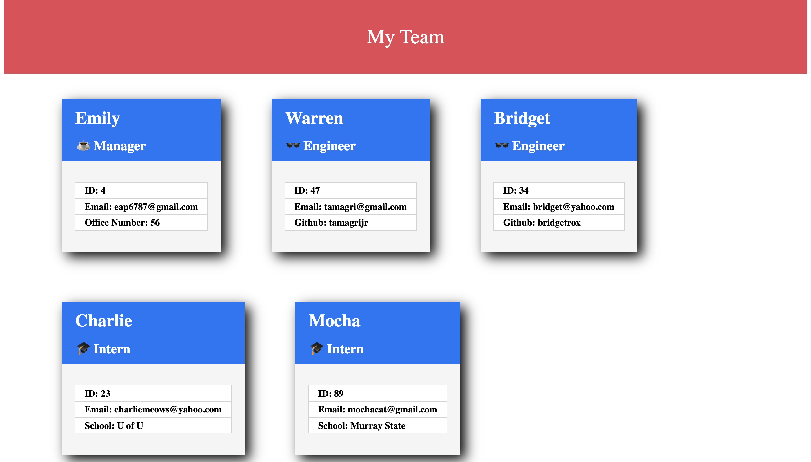

# office-roster
Office Roster is an application that takes in user input, using inquirer, and generates an HTML document of team cards based on the user's information. 

Office roster also uses Jest to perform tests on the different employee methods.

demo video: https://www.youtube.com/watch?v=ADAL0335JTU
github repo: https://github.com/emilypape/office-roster 

